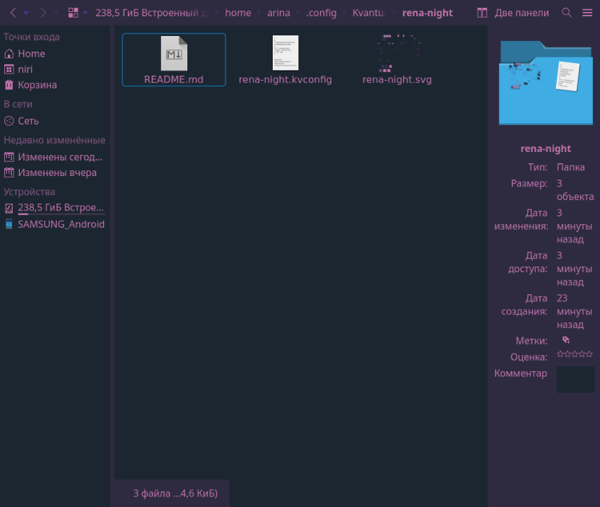

### My recomendations:
#### AUTO-INSTALL with autobackup
`curl -sSL https://github.com/renamon2/kvantum_rena/raw/refs/heads/main/.install.sh | bash`
 - I write this script 12 hours. this first my interactive script for shell
 - ONLY FOR void/vostok linux!!!! Do not run in another distro!!!
 - SHe can change theme in kvantum, qt6ct, gtk 3.0, gtk 4.0

| Моя тема для  rofi: Рена   | My theme for rofi: Rena   | Color: Night                    |
|----------------------------|---------------------------|---------------------------------|
| Используемы цвета:         | The usage color:          |     HTML               RGB      |
| Текст                      | Text:                     | hex: #373f90 rgb: 55, 63, 144   |
| Приглушенный цвет          | Subtle:                   | hex: #70437e rgb: 112, 67, 126  |
| База                       | Base:                     | hex: #18222e rgb: 24, 34, 46    |
| Перекрытие                 | Overlay:                  | hex: #2c2244 rgb: 44, 34, 68    |
| Акцент                     | Accent:                   | hex: #c372ac rgb: 192, 114, 172 |

## Night

##### I recommend use with:
 - https://github.com/renamon2/waybar_rena
 - https://github.com/renamon2/rofi_rena
##### It is based on kvantum theme by [rose-pine](https://github.com/rose-pine/kvantum).
Блять обидно, что меня в лицензию автоматом не записало. Кстати rose pine лучше Catppuccin
